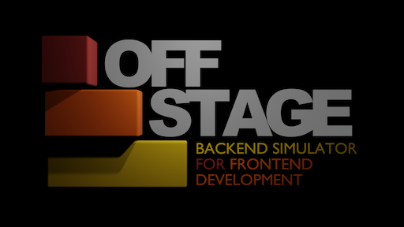
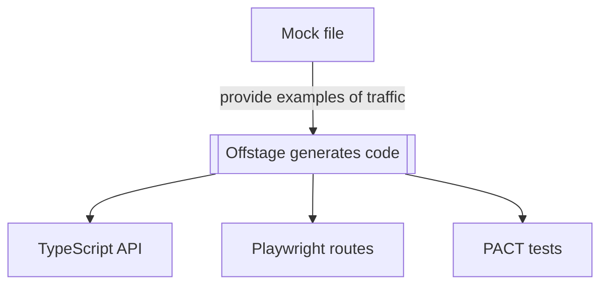

# 
-- Acting like a blazingly fast back-end 🔥

## Rationale
Frontend and Backend should be able to develop simultaneously. At some point they do have to communicate with eachother. We would like to ensure compatibility.

One option is to have the Backend generate a Frontend API. This has its drawbacks:
- Frontend has to wait on Backend.
- Does not provide mock data for testing purposes.

## Meet Offstage

Offstage uses mock data to connect to and simulate the backend.

- 🚀 Typed request API. With instant responses during development.
- 🎭 Playwright routes. With override for testing specific scenarios
- 🤝 PACT tests. Ensuring compatibility with backend (coming real soon!)
- 🔥 Dev speed. (no boilerplate + no waiting on backend) = blazingly fast development


## Demo
https://user-images.githubusercontent.com/59414067/197384608-43a81496-47bc-4f32-8ad9-83664b9af0af.mp4

## [Read the Documentation](https://livinglogic-nl.github.io/offstage/)

## Example

Mock file:
```ts
import { create, mock } from 'offstage';

// connect the api to the REST request
create('example.hello', 'POST /say-hello');

// mock the data transfer
mock('example.hello', {}, { message: 'Hello world!' });
mock('example.hello', { subject:'something specific' }, { message: 'Hello something specific!' });
```

Use in application:
```ts
import { example } from '@/offstage';

await example.hello(); // { message: 'Hello world!' }
await example.hello({ subject:'something specific' }); // { message: 'Hello something specific!' }
```

Use in Playwright:
```ts
import { mount } from 'offstage';

test('Clicking the button calls hello method and renders result message', async({ page }) => {
  await mount(page)
  await page.click('button');
  await page.waitForSelector('"Hello something specific!"');
});
```

## Sponsoring
A donation will help me to keep improving Offstage... As well as make more awesome software! 🎉
<iframe src="https://github.com/sponsors/livinglogic-nl/button" title="Sponsor livinglogic-nl" height="35" width="116" style="border: 0;"></iframe>

