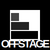

# 
-- Acting like a blazingly fast back-end 🔥

## Coming soon!
I'm actively working on this but it is not ready yet. Please check back soon!

Things I still need to do:
- sync via npx
- vite plugin
- integrate in first project

## What is Offstage?

Offstage uses mock data to connect and simulate the backend.
- 🚀 Typed request API. With instant responses during development.
- 🎭 Playwright routes. With override for testing specific scenarios
- 🤝 PACT tests. Ensuring compatibility with backend (coming soon!)

## Surprising bonus: dev speed boost ⚡️
I started to prevent repeating myself (reuse mock data for both Playwright and PACT).  
Dev speed was not a goal at all but seems to have improved dramatically by using Offstage.

## [Read the Documentation](https://livinglogic-nl.github.io/offstage/)

## Example

Mock file:
```ts
import { create, mock } from 'offstage';

// connect the api to the REST request
create('example.hello', 'POST /say-hello');

// mock the data transfer
mock('example.hello', {}, { message: 'Hello world!' });
mock('example.hello', { subject:'something specific' }, { message: 'Hello something specific!' });
```

Use in application:
```ts
import { example } from '@/offstage';

await example.hello(); // { message: 'Hello world!' }
await example.hello({ subject:'something specific' }); // { message: 'Hello something specific!' }
```

Use in Playwright:
```ts
import { mount } from 'offstage';

test('Clicking the button calls hello method and renders result message', async({ page }) => {
  await mount(page)
  await page.click('button');
  await page.waitForSelector('"Hello something specific!"');
});
```
